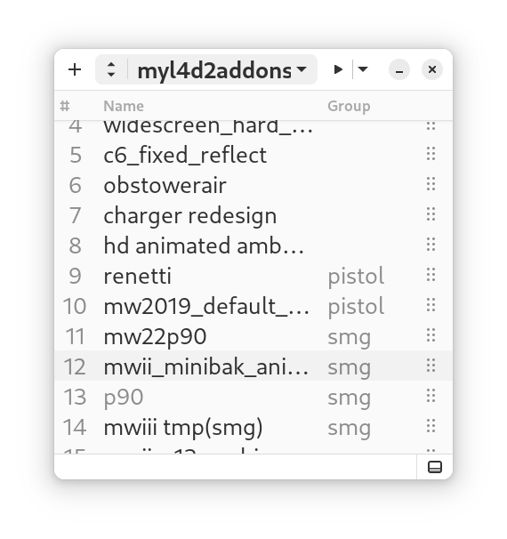

# stobo

Add-on manager for the game Left 4 Dead 2, for the GNOME desktop

## The Name

"Stobo" is a reference to a real-life Switzerland company named Stimbo. They specialize in hand-crafting electric taxis, buses, trucks, tippers, and other transports for their local community - the ski resort Zermatt.

This software is not affiliated with the company Stimbo in any way: the name reference is merely a token of adoration.
